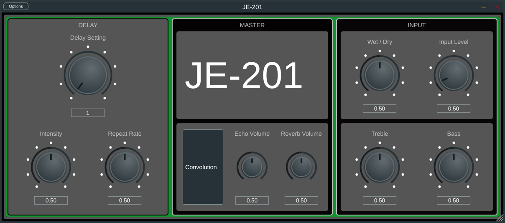

# RE201models

This repository is dedicated to digital modelling of the Roland RE-201.

## History

The original folder contains a (mostly) header only library implementing
four seperate digital models of a [Roland RE-201][8], developed throughout the
duration of my final year project, on the BSc Sound Engineering and Production
course at Birmingham City University. The models are classes which can be
implemented into an audio plugin in any framework.

The latest version is a significant improvement of the original and is not
header only. This is dedicated to optimisations which did not fit into the
time scale of my bachelors project and generally cleans up the code. This
includes processing by buffer instead of sample, optimising the filter
structures, adjustments to the WDF tone stack, reducing unnecessary
calculations and dynamic allocation of objects and memory based on channel
count. The error function tape saturation model has been omitted (because lets
be honest, tape hysteresis modelling is way cooler), however the tone stack
algorithm can be switched between VA and WDF by setting a bool variable in the
RE201model class.

The four models implemented combinations of two tape saturation and two tone
stack modellings methods. One tape saturation modelling method was a static
non linearity (error function) and the other was based on the hysteresis
processor developed by Chowdhury (2019) which calculates magnetisation based
on a tape playhead position derivative approximation. The tape delay modelling
between the two methods is the same, utilising three circular buffers with
read times at multiple of each other, in line with the real device (Using a
single buffer with multiple read heads was tested, however this appeared to
generate phasing issues when multiple playheads were active). Both methods
implement oversampling, albeit very inefficiently. The latest version attempts
to resolve many of those issues.

The first tone stack method implemented the VA Bassman 59' filter discretised
by Yeh (2006). The other tone stack was two WDF shelving filters processed in
series to make up the bass and treble frequency bands.

Other perceptual characteristics have been modelled, this includes wow and
flutter (although this is next on my improvements list), control ballistics
(pitch increases when the repeat rate is increasing and vice versa) and tape
speed dependant equalisation.

## Credits

[Jatin Chowdhury (2019)][0] - Tape magnetisation in models 2 and 4 implement a
hysteresis processor based on the algorithm developed by Chowdhury.

[Jatin Chowdhury (2022)][1] - The tone stacks in models 3 and 4 implement WDF
shelving filters which were contructed using the `chowdsp_wdf` library.

[S.A. Samad (2003)][2] - This paper details the theory behind parametric and
shelving WDF bands.

[David T. Yeh (2006)][3] - The tone stacks in models 1 and 2 were implemented
using an algorithm based on the VA discretised 59 bassman tone stack.

[HI-FI LO-FI][4] - All models implemented FFT convolution of the reverb only
setting of a Boss RE-2. The real time convolution was implemented using HI-FI
LO-FIs `TwoStageFFTconvolver` library.

[Will Pirkle][5] - Plugins were prototyped using RackAFX and original plugins
were generated using ASPIK.

[EarLevel Engineering (2012)][6] - This biquad was used in tape speed dependant
equalisation modelling, modified to be direct form 2 transposed.

[Daniel Walz][7] - GUI for JUCE versions of the plugin was created using
the `foleys_gui_magic` library.

## License

The main project is `GPL-3.0-only` (unsure if "GPL3" refers to `GPL-3.0-only`
or `GPL-3.0-or-later`), whereas all external libraries are licensed under
their respective licenses.

[0]: https://github.com/jatinchowdhury18/AnalogTapeModel
[1]: https://github.com/Chowdhury-DSP/chowdsp_wdf
[2]: https://journals.tubitak.gov.tr/elektrik/vol11/iss3/3/
[3]: https://ccrma.stanford.edu/~dtyeh/papers/yeh06_dafx.pdf
[4]: https://github.com/HiFi-LoFi/FFTConvolver
[5]: https://github.com/willpirkleaudio/ASPiK
[6]: https://www.earlevel.com/main/2012/11/26/biquad-c-source-code/
[7]: https://github.com/ffAudio/foleys_gui_magic
[8]: https://en.wikipedia.org/wiki/Roland_Space_Echo
